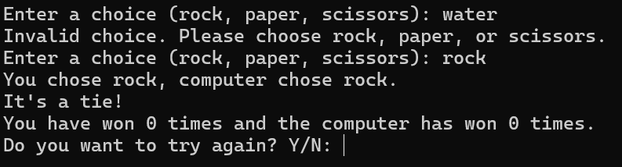

<h1>Rock-Paper-Scissors Game</h1>

This Python script is a simple command-line implementation of the classic Rock-Paper-Scissors game.

     
<h2>Features</h2>
<ul>
        <li><strong>User Input Validation:</strong> Ensures the player enters a valid choice (rock, paper, or scissors).</li>
        <li><strong>Random Computer Choice:</strong> Utilizes the <code>random</code> module for the computer's selection.</li>
        <li><strong>Game Logic:</strong> Determines the winner based on standard Rock-Paper-Scissors rules.</li>
        <li><strong>Score Tracking:</strong> Keeps track of the number of wins for both the player and the computer.</li>
        <li><strong>Replay Option:</strong> Allows the player to continue playing or exit the game.</li>
</ul>
 

 
<h2>Requirements</h2>
    <ul>
        <li>Python 3.x</li>
    </ul>

<h2>License</h2>

This project is licensed under the <a href="LICENSE">MIT License</a>.

